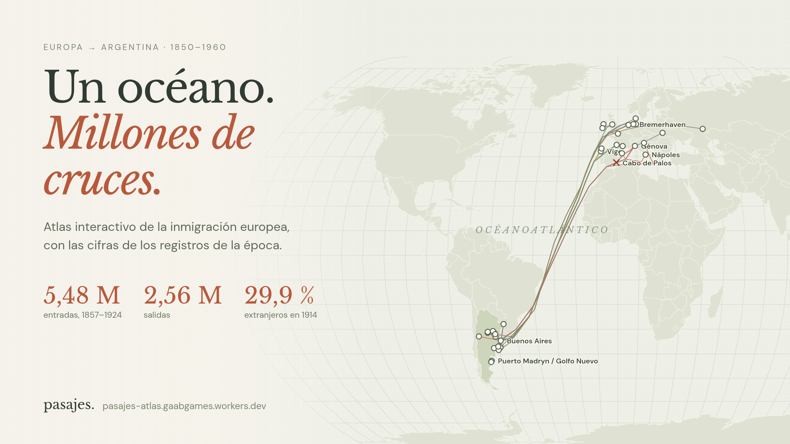

# Pasajes



Atlas de la inmigración europea a Argentina, 1850–1960. Segunda edición. Aplicación React/TypeScript con D3 y cartografía mundial local.

Contenido: 43 conexiones y 50 lugares en seis épocas, 13 comunidades o corrientes más una categoría de otros destinos, serie anual de entradas y salidas 1857–1924, 26 capítulos de investigación, 36 hitos de cronología y 75 referencias.

Publicado: https://pasajes-atlas.gaabgames.workers.dev (Cloudflare Workers, activos estáticos). Para volver a publicar: `pnpm build` y `~/.local/share/pnpm/bin/pnpm dlx wrangler deploy`.

Analítica: Cloudflare Web Analytics, sin cookies. El script se carga solo en el dominio publicado (ver el final de `src/main.tsx`). Cada cambio de pestaña cuenta como vista.

## Desarrollo

Usar Node 24 y pnpm.

```sh
pnpm install
pnpm dev
pnpm build
pnpm test
pnpm preview
```

El servidor escucha en 127.0.0.1:4570. `pnpm build` verifica TypeScript y genera `dist/`. Los datos y las fuentes tipográficas se sirven localmente; el mapa no depende de un servicio de teselas.

Código: `src/main.tsx` (aplicación y atlas), `src/AtlasMap.tsx` (mapa), `src/Charts.tsx` (serie anual y barras), `src/Pages.tsx` (cifras, investigación, cronología, fuentes), `src/style.css` (base de la primera edición), `src/extra.css` (gráficos, cronología) y `src/atlas.css` (escenario del mapa).

El atlas usa el mapa como escenario: panel flotante que alterna lista y ficha, chips de época y capas sobre el mapa, resaltado cruzado entre lista y trazos, encuadre automático de la selección, flechas del teclado para recorrer conexiones y, por debajo de 900 px, una hoja bajo el mapa en lugar del panel.

## Datos e investigación

`pnpm data` regenera todo en el orden correcto. Equivale a:

```sh
python3 scripts/make-data.py      # fuentes, épocas, lugares, grupos y rutas base
python3 scripts/enrich-data.py    # irlandeses, Volga, daneses, escalas del Massilia
python3 scripts/deepen-data.py    # series estadísticas, contingentes, cronología, cifras por época
python3 scripts/make-research.py  # capítulos e investigacion.md
```

El orden importa: cada paso lee lo que escribió el anterior. Los cuatro scripts contienen afirmaciones de control sobre los totales, y fallan si una cifra transcrita deja de cerrar.

`public/data/stats.json` contiene las series. Las entradas y salidas anuales por nacionalidad provienen de Ferenczi y Willcox, *International Migrations* I (NBER, 1929), páginas 539–547, que reproducen la estadística de la Dirección General de Inmigración. Son pasajeros extranjeros de segunda y tercera clase por vía marítima. Excluyen primera clase y el tráfico fluvial con Montevideo, y cuentan cruces, no personas. La transcripción se verificó con dos lecturas ópticas y contra los totales impresos: 5.481.276 entradas y 2.562.790 salidas. Los destinos por provincia y los oficios vienen del folleto oficial de 1904. Las discrepancias conocidas están descritas en el capítulo «Qué sabemos y qué falta».

Las conexiones del mapa son cualitativas y sus curvas esquemáticas. No representan cantidades ni derroteros. Los contingentes y viajes con fecha (Mimosa, Weser, Hinojo, Pigüé, San José, Caroya, Tres Arroyos, Sirio, Príncipe de Asturias, Massilia) tienen un solo año y evidencia propia. Cuando los recuentos difieren entre relatos, el texto da el rango. Natural Earth muestra fronteras contemporáneas.

Las referencias distinguen estadística histórica, fuentes primarias, estudios, archivos, páginas institucionales, prensa y bibliografía. La edición no afirma lectura íntegra de todos los libros ni investigación presencial. Los censos incluyen extranjeros de todos los orígenes y no miden ascendencia.

## Verificación

`pnpm test` comprueba referencias, coordenadas, fechas, sumas de las series, coherencia de nacionalidades y destinos, porcentajes censales y cartografía.

`pnpm test:browser` usa Playwright con Chromium del sistema y debe ejecutarse dentro de omabox, con el proyecto montado y el puerto 4570 permitido:

```sh
omabox up --net isolated --allow 4570 --ro-bind "$PWD"
cp ~/.cache/node/corepack/v1/pnpm/12.6.0/pnpm-native "$(omabox path)/home/pnpm"
omabox run -- env PATH=$HOME/.local/share/mise/installs/node/24.21.0/bin:/usr/bin /home/sbx/pnpm --dir "$PWD" test:browser
omabox down
```

Prueba mapa, resaltado lista-mapa, teclado, chips de época, capa de destinos, ficha de lugar, nueve pasos guiados, gráfico de la serie, tablas, cronología, búsquedas, descargas, cuatro páginas en móvil y movimiento reducido. Guarda capturas en el HOME de la caja. No abre el escritorio del usuario.

Verificación del 7 de octubre de 2026: compilación, diez controles de datos y prueba de navegador aprobados. Chromium se ejecutó en una caja omabox con pantalla virtual, en 1440×1000 y 390×844. Se inspeccionaron capturas de atlas, destinos, cifras, investigación y cronología.

## Cómo se hizo

La investigación, los datos y el código los produjo Claude Opus 5.5 (Claude Code) a pedido y bajo revisión de una persona. El modelo buscó y descargó las fuentes, transcribió las tablas estadísticas con dos lecturas ópticas independientes y verificó las sumas contra los totales impresos. Las afirmaciones llevan su fuente y los límites están descritos en el capítulo de metodología. Puede haber errores: los issues y las correcciones son bienvenidos.

`scripts/cover.mjs` genera la portada a partir del atlas real.
